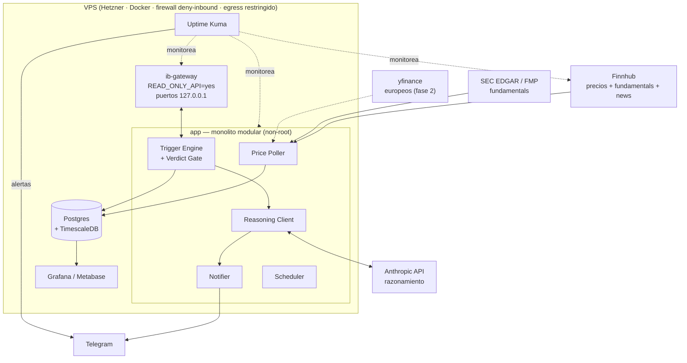

# CLAUDE.md — Portfolio Monitor & Alerting System

> Documento de handoff. Contiene todo el contexto de diseño para que Claude Code
> (o cualquier dev) genere el proyecto sin volver a discutir las decisiones.
> Leer completo antes de scaffoldear.

---

## 1. Qué es (y qué NO es) este sistema

Un sistema **read-only** que monitorea portfolios en Interactive Brokers, detecta
movimientos relevantes de precio (ej: caída de X% en Y tiempo), cruza esa señal
contra la **tesis/veredicto** de cada activo, y **avisa al usuario por Telegram**
con una sugerencia contextualizada (ej: "cayó 5% y los fundamentals siguen sólidos,
podés sumar ~$X").

**Reglas duras (no negociables):**
- ❌ **NUNCA ejecuta órdenes.** No compra, no vende. Solo observa y notifica.
- ✅ **Human-in-the-loop siempre.** El usuario es el único que aprieta "comprar" en IBKR.
- ✅ **IBKR en modo `READ_ONLY_API`.** Aunque se comprometa el host, no puede operar.
- El sistema *prepara la decisión*, no la toma.

---

## 2. Arquitectura (alto nivel)

Monolito modular (la app nuestra) + pocos containers separados por dominio de falla.
**No microservicios** — over-engineering para un sistema personal de un solo dev.



---

## 3. Stack

| Capa | Herramienta | Notas |
|---|---|---|
| Lenguaje | Python | monolito modular |
| Broker (posiciones/fundamentals) | `ib_async` + IB Gateway | NO `ib_insync` (deprecado). Gateway requerido para fundamentals. |
| Data backbone (precios/news) | **Finnhub** (free ~60 req/min) | quotes + fundamentals + estimates + news |
| Fundamentals autoritativos | **SEC EDGAR** (free) / **FMP** | US. EDGAR = estados financieros oficiales |
| Cobertura europea (fase 2) | **yfinance** o **EODHD** | para defensa (Thales, Leonardo, BAE, Rheinmetall) |
| DB | **Postgres** (+ TimescaleDB) | fuente de verdad. NO Mongo (data relacional) |
| Razonamiento | **Anthropic API** | recibe precio+fundamentals+veredicto → sugerencia |
| Notificaciones | **Telegram bot** | canal de alertas |
| Uptime/health | **Uptime Kuma** + **healthchecks.io** | monitorea APIs, gateway, app |
| Dashboards | **Grafana** (infra + series) + **Metabase/Superset** (analítica/Sankey) | leen de Postgres |
| Orquestación | **Docker Compose** | en la VPS |

---

## 4. Modelo de dominio

### Cuentas
| Cuenta | ID IBKR | Rol |
|---|---|---|
| Satélite IA (Picks & Shovels) | `U22106929` | 16 stocks de IA |
| Satélite Salud/Defensa | `U26716079` | salud (comprado) + defensa (fase 2, EUR) |
| Core UCITS | *(por crear)* | VWCE — se fondea con los $5k que entran. Prioridad por PRIIPs |
| eToro (legacy) | — | VOO/QQQ/SWDA/copy. Congelado (PRIIPs). **No es target de compra** |

### Veredictos por ticker → mapean a la acción del Verdict Gate

| Veredicto | Acción en el gate |
|---|---|
| **Crecer** | Candidato fuerte de compra en dip |
| **Mantener** | Candidato de compra en dip |
| **Mantener - no sumar** | ❌ NO sugerir compra (posición capada). Solo informativo |
| **Trim - tomar ganancias** | ❌ NO sugerir compra. (Opcional: alertar si SUBE, para reducir) |
| **Consolidar** | ❌ NO sugerir compra (se va a consolidar en otro nombre) |
| **Objetivo (sin comprar)** | Fase 2, aún no activo |
| **Migrar a UCITS** | N/A |

### Config de veredictos actual (seed)

**Cuenta IA (`U22106929`):**
`NVDA`=Mantener · `AVGO`=Mantener · `ASML`=Mantener · `ANET`=Mantener ·
`TSM`=Mantener · `MSFT`=Mantener · `VRT`=Mantener · `ETN`=Mantener ·
`ARM`=Mantener · `GEV`=Mantener · `GOOG`=Crecer · `MU`=Trim ·
`CEG`=Mantener-no-sumar · `AMD`=Mantener-no-sumar · `MRVL`=Consolidar · `QCOM`=Consolidar

**Cuenta Salud/Defensa (`U26716079`):**
`LLY`=Crecer · `ISRG`=Mantener · `NVO`=Mantener · `ABBV`=Mantener · `TMO`=Mantener
`HO.PA`(Thales)=Objetivo · `LDO.MI`(Leonardo)=Objetivo · `BA.L`(BAE)=Objetivo · `RHM.DE`(Rheinmetall)=Objetivo

> Los veredictos son **config**, viven en la DB y se editan sin tocar código.

---

## 5. Lógica de triggers (la parte inteligente)

1. **Detección:** para cada ticker habilitado, mantener ventana móvil de precios y
   calcular % de cambio sobre un trailing `Y` (configurable). Disparar si cae ≥ umbral
   (default **-4% a -5%**, por-ticker configurable).
2. **Verdict Gate:** filtrar según la tabla de la sección 4. Solo `Crecer`/`Mantener`
   generan sugerencia de compra. `Trim`/`Consolidar`/`no-sumar` → no sugieren (a lo sumo informativo).
3. **Chequeo de fundamentals:** al gatillar, traer fundamentals (revenue growth, márgenes,
   P/E, deuda) para que la señal sea "cayó Y los fundamentals siguen sólidos" (oportunidad)
   vs "cayó y el fundamento se deterioró" (evitar).
4. **Bucket awareness:** leer el cash disponible / bucket de DCA-dip; no sugerir más de lo que queda.
5. **Cooldown:** una alerta por ticker por día (reset cuando el precio recupera sobre el umbral).
6. **Razonamiento (Anthropic):** armar prompt con {ticker, movimiento, ventana, veredicto,
   fundamentals, bucket restante, historial reciente} → devuelve texto de sugerencia corto.
7. **Notificar:** enviar por Telegram. **Ahí termina.** El usuario decide y ejecuta.

---

## 6. Schema de Postgres (borrador)

```sql
-- Cuentas
CREATE TABLE accounts (
  id          SERIAL PRIMARY KEY,
  ibkr_id     TEXT UNIQUE,          -- U22106929, etc. NULL para eToro
  name        TEXT NOT NULL,
  role        TEXT NOT NULL         -- 'ia' | 'salud_defensa' | 'core_ucits' | 'legacy'
);

-- Posiciones (estado actual; se sincroniza desde IBKR)
CREATE TABLE holdings (
  id          SERIAL PRIMARY KEY,
  account_id  INT REFERENCES accounts(id),
  ticker      TEXT NOT NULL,
  company     TEXT,
  cluster     TEXT,                 -- Compute/GPU, Networking, Salud, Defensa, ...
  shares      NUMERIC,
  avg_cost    NUMERIC,
  verdict     TEXT NOT NULL,        -- ver tabla sección 4
  target_pct  NUMERIC,              -- % objetivo dentro del sleeve (opcional)
  thesis      TEXT,
  updated_at  TIMESTAMPTZ DEFAULT now(),
  UNIQUE(account_id, ticker)
);

-- Config de triggers por ticker
CREATE TABLE ticker_config (
  ticker          TEXT PRIMARY KEY,
  threshold_pct   NUMERIC DEFAULT -4.5,
  window_minutes  INT DEFAULT 390,   -- ~1 rueda US
  enabled         BOOLEAN DEFAULT true
);

-- Serie de precios (TimescaleDB hypertable)
CREATE TABLE prices (
  ticker  TEXT NOT NULL,
  ts      TIMESTAMPTZ NOT NULL,
  price   NUMERIC NOT NULL,
  source  TEXT,                     -- 'finnhub' | 'yfinance' | 'ibkr'
  PRIMARY KEY (ticker, ts)
);
-- SELECT create_hypertable('prices', 'ts');

-- Snapshots de portfolio (histórico de totales por cuenta)
CREATE TABLE portfolio_snapshots (
  account_id     INT REFERENCES accounts(id),
  ts             TIMESTAMPTZ NOT NULL,
  market_value   NUMERIC,
  unrealized_pl  NUMERIC,
  cash           NUMERIC,
  PRIMARY KEY (account_id, ts)
);

-- Fundamentals (snapshots para chequeo de tesis)
CREATE TABLE fundamentals (
  ticker          TEXT NOT NULL,
  ts              TIMESTAMPTZ NOT NULL,
  pe              NUMERIC,
  revenue_growth  NUMERIC,
  gross_margin    NUMERIC,
  debt_to_equity  NUMERIC,
  raw             JSONB,            -- payload completo por si acaso
  source          TEXT,
  PRIMARY KEY (ticker, ts)
);

-- Alertas emitidas (auditoría + cooldown)
CREATE TABLE alerts (
  id               SERIAL PRIMARY KEY,
  ticker           TEXT NOT NULL,
  ts               TIMESTAMPTZ DEFAULT now(),
  trigger_type     TEXT,            -- 'drop_pct'
  pct_change       NUMERIC,
  window_minutes   INT,
  verdict          TEXT,
  suggestion       TEXT,            -- texto devuelto por Claude
  bucket_remaining NUMERIC,
  sent_via         TEXT DEFAULT 'telegram',
  status           TEXT DEFAULT 'sent'
);

-- Salud de fuentes de datos (para el monitoreo)
CREATE TABLE data_source_health (
  source     TEXT NOT NULL,
  ts         TIMESTAMPTZ DEFAULT now(),
  status     TEXT,                  -- 'up' | 'down' | 'degraded'
  latency_ms INT
);
```

---

## 7. Hosting & deployment

- **VPS:** Hetzner CX22 (2 vCPU / 4 GB RAM / 40 GB) ~€4-5/mes. Datacenter EU.
- **IB Gateway:** imagen `ghcr.io/gnzsnz/ib-gateway`. Trae IBC + Xvfb.
  - `READ_ONLY_API=yes`
  - Puertos bindeados a `127.0.0.1` (default de la imagen) — **nunca públicos**
  - `AUTO_RESTART_TIME` para el restart diario; configurar manejo de 2FA
  - Footprint ~1-1.5 GB RAM (spikea con fundamentals)
- **Compose services:** `ib-gateway`, `app`, `postgres`, `uptime-kuma`, `grafana` (+ `metabase` opcional).
- **Redes:** bridge interno para `app` ↔ `gateway` ↔ `postgres` (sin exponer). `app` con egress solo a Finnhub, Anthropic, Telegram, EDGAR/FMP.

---

## 8. Seguridad (blindaje) — checklist

**VPS:**
- SSH solo con clave (password auth OFF, root login OFF), usuario no-root con sudo
- Firewall **default-deny inbound** (la app es solo saliente; no abrir puertos)
- Healthcheck vía ping SALIENTE (healthchecks.io), no abriendo puertos
- `fail2ban` + `unattended-upgrades` + paquetes mínimos

**Docker:**
- Puerto del gateway (4001/4002) **jamás** público (127.0.0.1 / red interna)
- Containers non-root (`USER` en Dockerfile), `cap_drop: ALL`, `no-new-privileges`, FS read-only donde se pueda
- **Secretos fuera de la imagen:** Docker secrets o `.env` (perms 600), NUNCA commiteados
- Imágenes pineadas por digest + escaneadas (Trivy)
- Egress restringido a los destinos necesarios

**IBKR:**
- `READ_ONLY_API` activado (red de seguridad crítica)

---

## 9. Monitoreo de infra

- **Uptime Kuma** (container): monitorea HTTP/TCP de Finnhub, EODHD, Anthropic, puerto
  del gateway, health endpoint de la app → alertas a Telegram. Status page incluida.
- **healthchecks.io** (dead-man's switch): si el loop deja de pingear → aviso. Detecta el silencio.
- **Status pages de proveedores:** Finnhub tiene status page oficial (en su dashboard).
  Pollear el `/api/v2/status.json` (Atlassian Statuspage) donde exista para auto-clasificar
  "caída de ellos" vs "bug nuestro".

---

## 10. Dashboards

- **Grafana** (principal): infra/ops + series temporales de portfolio, temas dark alto contraste. Sankey vía plugin ECharts.
- **Metabase / Superset** (opcional): analítica exploratoria; Superset tiene **Sankey nativo**
  (viz deseada: flujo cash → cuentas → clusters → posiciones).
- Todas leen **nativo de Postgres**. Cadena: `app → Postgres → Grafana/Metabase`.

---

## 11. Orden de build (roadmap)

1. **Scaffold:** estructura de repo, `docker-compose.yml`, `.env.example`, `CLAUDE.md`, migraciones Postgres.
2. **Data layer:** cliente Finnhub + price poller → escribe a Postgres.
3. **Gateway:** container `ib-gateway` + cliente `ib_async` para sync de posiciones.
4. **Trigger engine:** ventana móvil + Verdict Gate + cooldown + bucket.
5. **Fundamentals:** cliente EDGAR/FMP + snapshots.
6. **Reasoning:** cliente Anthropic (arma el prompt con contexto).
7. **Notifier:** bot de Telegram.
8. **Monitoring:** Uptime Kuma + healthchecks + pollers de status.json.
9. **Dashboards:** Grafana/Metabase sobre Postgres.

> Empezar por el scaffold. Ir módulo por módulo, revisando. No volcar todo junto.

---

## 12. Guardrails para Claude Code

- 🔴 El sistema **NUNCA** ejecuta órdenes. Solo lee y notifica. No agregar features de trading.
- 🔴 IBKR siempre en `READ_ONLY_API`.
- 🔴 **Nunca** commitear secretos. Generar `.env.example` con placeholders.
- Containers non-root; puertos sensibles a localhost/red interna.
- Pedir confirmación antes de operaciones destructivas (borrar volúmenes, DBs, etc.).
- Preferir monolito modular; extraer a container aparte solo si un dominio de falla lo justifica.
- Data delayed (~15 min) es aceptable — el usuario es de mediano plazo, no HFT. No sobre-optimizar latencia.

---

## 13. Decisiones abiertas / TODO

- [ ] Elegir provider de fundamentals definitivo (EDGAR vs FMP vs Finnhub) según cobertura real.
- [ ] Definir manejo fino del 2FA headless del Gateway (token auto-restart).
- [ ] ¿Mantener Airtable como front-end mobile de edición + sync a Postgres, o migrar 100%?
- [ ] Cobertura europea (defensa) — activar EODHD "EOD+Intraday Extended" (~$25/mes) en fase 2.
- [ ] Umbral y ventana por-ticker: revisar defaults (-4.5%, 1 rueda) contra fatiga de alertas.
